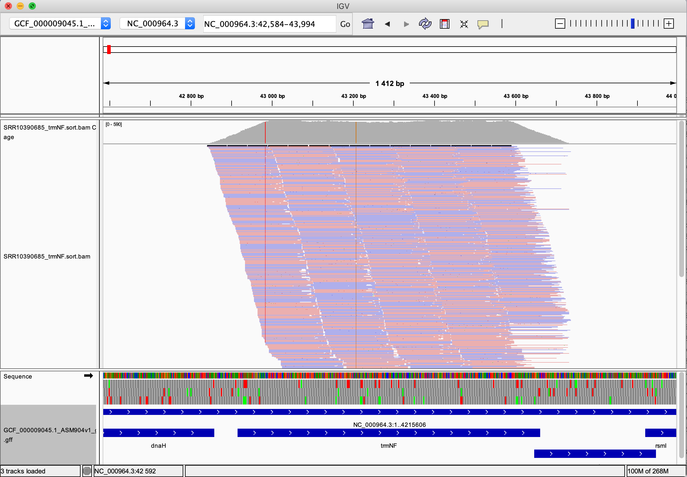

```{r setup, include=FALSE}
knitr::opts_chunk$set(eval=FALSE, echo =TRUE, cache = FALSE, message = FALSE, warning = FALSE, cache.lazy = FALSE,
                      fig.height = 3.5, fig.width = 10.5)
```

# Consignes {-}

Complétez ce document en remplissant les chunks vides pour écrire le code qui vous a permis de répondre à la question. Les réponses attendant un résultat chiffré ou une explication devront être insérés entre le balises html `code`. Par exemple pour répondre à la question suivante :

    La bioinfo c'est : <code>MERVEILLEUX</code>.
    
N'hésitez pas à commenter votre code, enrichier le rapport en y insérant des résultats ou des graphiques/images pour expliquer votre démarche. N'oubliez pas les **bonnes pratiques** pour une recherche **reproductible** !
Nous souhaitons à minima que l'analyse soit reproductible sur le cluster de l'IFB.

# Introduction {-}

Vous allez travailler sur des données de reséquençage d'un génome bactérien : _Bacillus subtilis_. Les données sont issues de cet article :

* [Complete Genome Sequences of 13 Bacillus subtilis Soil Isolates for Studying Secondary Metabolite Diversity](https://mra.asm.org/content/9/2/e01406-19)

# Analyses

## Organisation de votre espace de travail

```{bash creation espace de travail}
# Creer son espace de travail
## Faire un répetoire pour chaque type de données
mkdir -p ~/M4-5-Eval/FASTQ  
mkdir -p ~/M4-5-Eval/CLEANING
mkdir -p ~/M4-5-Eval/MAPPING
mkdir -p ~/M4-5-Eval/QC
mkdir -p ~/M4-5-Eval/REF

# Vérification de l'espace de travail 
cd ~/M4-5-Eval
tree ~/M4-5-Eval

```

## Téléchargement des données brutes

Récupérez les fichiers FASTQ issus du run **SRR10390685** grâce à l'outil <strong class="tool">sra-tools</strong> @sratoolkit

```{bash données brutes}
# Il faut en premier lieu loader le module sra-tools puis spécifier le répertoire de destination est FASTQ
module load  sra-tools
fasterq-dump -h
srun --cpus-per-task=6 fasterq-dump --split-files -p SRR10390685 --outdir FASTQ

# on zip les données 
cd ~/M4-5-Eval/FASTQ
srun gzip *.fastq
```

Combien de reads sont présents dans les fichiers R1 et R2 ?

```{bash Nombre de reads sur les fichiers R1 et R2}
#On sait que la synthaxe FASTQ est faite de telle sorte que 1 seul read s'écrit sur 4 lignes (Info avec numéro de machine, la séquence, le + qui est un séparateur et sur la dernière ligne le code de qualité du read). On compte donc le nombre de lignes présentes dans le fichier fastq et on le divise par 4. 

echo $(zcat SRR10390685_1.fastq.gz|wc -l)/4|bc
echo $(zcat SRR10390685_2.fastq.gz|wc -l)/4|bc

# on peut également utiliser le code suivant avec la commande seqkit (module qu'il faut également loader), cela permet de vérifier si les résultats sont les mêmes 
module load seqkit
srun seqkit stats --threads 1 *.fastq.gz

#file                    format  type   num_seqs        sum_len  min_len  avg_len  max_len
#SRR10390685_1.fastq.gz  FASTQ   DNA   7,066,055  1,056,334,498       35    149.5      151
#SRR10390685_2.fastq.gz  FASTQ   DNA   7,066,055  1,062,807,718      130    150.4      151

```

Les fichiers FASTQ contiennent <code>7066055</code> reads.

Téléchargez le génome de référence de la souche ASM904v1 de _Bacillus subtilis_ disponible à [cette adresse](https://ftp.ncbi.nlm.nih.gov/genomes/all/GCF/000/009/045/GCF_000009045.1_ASM904v1/GCF_000009045.1_ASM904v1_genomic.fna.gz)

```{bash génome de référence}
# se mettre dans le répertoire de travail REF : 

cd ~/M4-5-Eval/REF
wget https://ftp.ncbi.nlm.nih.gov/genomes/all/GCF/000/009/045/GCF_000009045.1_ASM904v1/GCF_000009045.1_ASM904v1_genomic.fna.gz
```

Quelle est la taille de ce génome ?

```{bash taille génome de référence }

srun seqkit stats --threads 1 GCF_000009045.1_ASM904v1_genomic.fna 

```

La taille de ce génome est de <code> 4,215,606 </code> paires de bases.

Téléchargez l'annotation de la souche ASM904v1 de _Bacillus subtilis_ disponible à [cette adresse](https://ftp.ncbi.nlm.nih.gov/genomes/all/GCF/000/009/045/GCF_000009045.1_ASM904v1/GCF_000009045.1_ASM904v1_genomic.gff.gz)

```{bash annotation }
wget https://ftp.ncbi.nlm.nih.gov/genomes/all/GCF/000/009/045/GCF_000009045.1_ASM904v1/GCF_000009045.1_ASM904v1_genomic.gff.gz
```

Combien de gènes sont connus pour ce génome ?

```{bash, nb de gènes connus pour le génome}
# décompression du fichier gff.gz pour faire un awk dessus
gunzip GCF_000009045.1_ASM904v1_genomic.gff.gz

# awk pour sélectionner dans la colonne 3 ceux qui ont un identifiant 'gene' et avec wc -l je demande l'affichage du nombre de lignes. 
awk '$3=="gene"' GCF_000009045.1_ASM904v1_genomic.gff | wc -l
```

<code>4448</code> gènes sont recensés dans le fichier d'annotation.

## Contrôle qualité

Lancez l'outil <strong class="tool">fastqc</strong> @fastqc dédié à l'analyse de la qualité des bases issues d'un séquençage haut-débit

```{bash contrôle qualité}

module load fastqc
srun --cpus-per-task 8 fastqc FASTQ/SRR10390685_1.fastq.gz -o QC/ -t 8
srun --cpus-per-task 8 fastqc FASTQ/SRR10390685_2.fastq.gz -o QC/ -t 8

```

La qualité des bases vous paraît-elle satisfaisante ? Pourquoi ?

- [X] Oui
- [ ] Non


car <code> On remarque que les valeurs de score qualité sont > 30  (> Q30).</code> comme le montre <code> le rapport de controle qualité Fastq et plus précisément le graphique “FastQ mean quality Scores” </code> comme le montre <code> </code>

Lien vers le [rapport MulitQC] (https://fabienne-nr.github.io/Evaluation_M4M5/multiqc_report.html)

Est-ce que les reads déposés ont subi une étape de nettoyage avant d'être déposés ? Pourquoi ?

- [X] Oui
- [ ] Non

car <code>les reads sont de différentes longueurs comme montrés sur le graphique Sequence Length Distribution</code>

Quelle est la profondeur de séquençage (calculée par rapport à la taille du génome de référence) ?

```{bash Calcul de la profondeur de séquençage}
# Utilisation de la formule
# C = N*L/G ; avec N = Nombre de lectures total (ici 7066055 pour chaque reads donc il faut multiplier par 2), L = Longueur des lectures et G = Taille du génome 
# ((7066055 * 2) * 151) / 4215606 = 506.2021  
```

La profondeur de séquençage est de : <code> 506 </code> X.

## Nettoyage des reads

Vous voulez maintenant nettoyer un peu vos lectures. Choisissez les paramètres de <strong class="tool">fastp</strong> @fastp qui vous semblent adéquats et justifiez-les.

```{bash nettoyage des reads}
# Changer de repertoire de travail
cd ..

# charger le module fastp
module load fastp

# Récupérer les fastq.gz (en entrée --int1 et -- int2), spécifier la sortie dans le dossier CLEANING avec les options --out1 et --out2 et indiquer le fichier fastp.html et fastp.json dans le repertoir CLEANING. 

srun --cpus-per-task 8 fastp --in1 FASTQ/SRR10390685_1.fastq.gz --in2 FASTQ/SRR10390685_2.fastq.gz --out1 CLEANING/SRR10390685_1.cleaned_filtered.fastq.gz --out2 CLEANING/SRR10390685_2.cleaned_filtered.fastq.gz --html CLEANING/fastp.html --thread 8 --cut_mean_quality 30 --cut_window_size 8 --length_required 100 --cut_tail --json CLEANING/fastp.json

```

|Parametre | Valeur | Explication |
|----------|--------|-------------|
| cut_mean_quality  |30 |on accepte une erreur sur 1000 et on a donc une précision de base de 99.9% |`
|cut_window_size | 8 |Spécifie le nombre de bases pour faire la moyenne de la qualité |
|Length_required |100| on ne garde que les reads de 100 pb minimum |

Ces paramètres ont permis de conserver <code>13554096</code> reads pairés, soit une perte de <code>4,09</code>% des reads bruts.

## Alignement des reads sur le génome de référence

Maintenant, vous allez aligner ces reads nettoyés sur le génome de référence à l'aide de <strong class="tool">bwa</strong> @bwa et <strong class="tool">samtools</strong> @samtools.

```{bash Mapping des reads}
# changement de repertoire de travail 
cd ~/M4-5-Eval/MAPPING/

# chargement du module bwa
module load bwa

# Indexer la séquence de référence qui se trouve dans le repertoire REF 
srun bwa index ~/M4-5-Eval/REF/GCF_000009045.1_ASM904v1_genomic.fna.gz

# Faire un bwa mem
srun --cpus-per-task=32 bwa mem ~/M4-5-Eval/REF/GCF_000009045.1_ASM904v1_genomic.fna.gz ../CLEANING/SRR10390685_1.cleaned_filtered.fastq.gz ../CLEANING/SRR10390685_2.cleaned_filtered.fastq.gz -t 32 > SRR10390685.sam

# Transformation du fichier sam en bam via samtools
module load samtools
srun --cpus-per-task=8 samtools view --threads 8 SRR10390685.sam -b > SRR10390685.bam
srun samtools sort SRR10390685.bam -o SRR10390685.sort.bam
srun samtools index SRR10390685.sort.bam

# Statistiques 
srun samtools idxstats SRR10390685.sort.bam > SRR10390685.sort.bam.idxstats
srun samtools flagstat SRR10390685.sort.bam > SRR10390685.sort.bam.flagstat

# multiQC
multiqc .d .o

```

Combien de reads ne sont pas mappés ?

```{bash Reads non mappés} 
cat ../samtools flagstat SRR10390685.sort.bam > SRR10390685.sort.bam.flagstat


#13571369 + 0 in total (QC-passed reads + QC-failed reads)
#0 + 0 secondary
#17273 + 0 supplementary
#0 + 0 duplicates
#12826829 + 0 mapped (94.51% : N/A)
#13554096 + 0 paired in sequencing
#6777048 + 0 read1
#6777048 + 0 read2
#12746370 + 0 properly paired (94.04% : N/A)
#12769290 + 0 with itself and mate mapped
#40266 + 0 singletons (0.30% : N/A)
#0 + 0 with mate mapped to a different chr
#0 + 0 with mate mapped to a different chr (mapQ>=5)

## Le nombre de reads non mappés 
# unmapped = "total" - "mapped" - "singletons"

echo "13571369-12826829-40266" | bc

```


<code>704274</code> reads ne sont pas mappés.

## Croisement de données

Calculez le nombre de reads qui chevauchent avec au moins 50% de leur longueur le gène _trmNF_ grâce à l'outil <strong class="tool">bedtools</strong> @bedtools:

```{bash croisement des données}
# chargement du module 
module load bedtools

# récupération du gène d'intérêt 
grep trmNF ../REF/GCF_000009045.1_ASM904v1_genomic.gff | awk '$3=="gene"' > trmNF_gene.gff3


# bedtools intersect avec -f à 0.5
srun bedtools intersect -a SRR10390685.sort.bam -b trmNF_gene.gff3 -sorted -f 0.5 > SRR10390685_trmNF.bam 


# Tri et indexage des reads
srun samtools sort SRR10390685_trmNF.bam -o SRR10390685_trmNF.sort.bam
srun samtools index SRR10390685_trmNF.sort.bam
srun samtools idxstats SRR10390685_trmNF.sort.bam > SRR10390685_trmNF.sort.bam.idxstats

# Calcul du nombre de read chevauchant 
cat SRR10390685_trmNF.sort.bam.idxstats 

#NC_000964.3	4215606	2801	0
#@*	0	0	0


```

<code> 2801 </code> reads chevauchent le gène d'intérêt.


## Visualisation

Utilisez <strong class="tool">IGV</strong> @igv sous [sa version en ligne](https://igv.org/app/) pour visualiser les alignements sur le gène. Faites une capture d'écran du gène entier.



# References